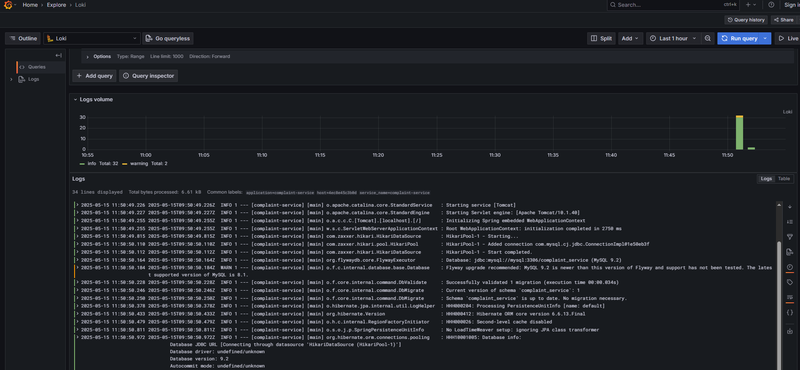
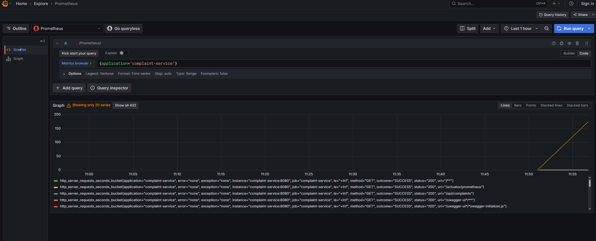
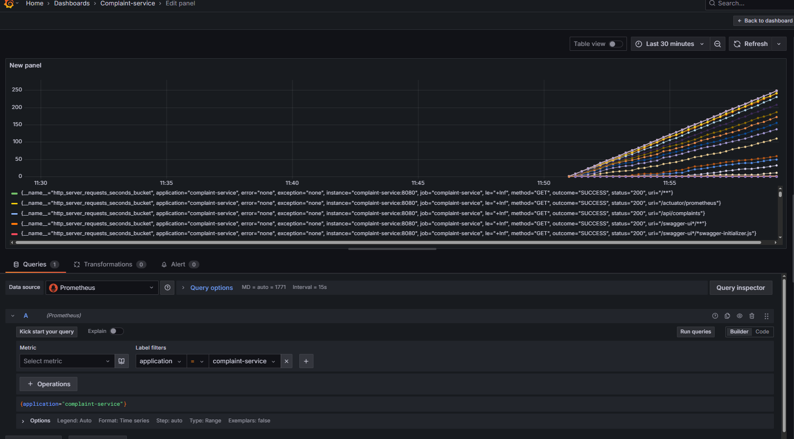

# Complaint service
REST service for managing complaints

## Prerequisites
Before running the project, ensure you have the following installed:
- **Docker**
- **Docker Compose**


### Running the project
To start the project, execute the following commands in the root directory:

```sh
mvn clean install

docker compose up --build -d
```

### Stopping the project
To stop and remove all containers, use:

```sh
docker-compose down
```

To stop the containers without removing them, use:

```sh
docker-compose stop
```

### Tools
| Tool            | URL                      | Login Credentials (if required)                   | Description                         |
|-----------------|--------------------------|---------------------------------------------------|-------------------------------------|
| Adminer (MySQL) | http://localhost:8088    | Server : `mysql`, User: `root`, Password: `mysql` | UI to manage MySQL                  |
| OpenAPI         | http://localhost:8080    | -                                                 | OpenAPI definition                  |
| Grafana         | http://localhost:3000    | User: `admin`, Password: `admin`                  | Logs & metrics dashboard            |
| Prometheus      | http://localhost:9090    | -                                                 | App metrics (CPU, memory, requests) |


## Observability
### Logging
- **Loki** aggregates logs for the service.
Logs can be queried using **Grafana** to monitor application behavior.



### Metrics & Monitoring
- **Prometheus** (`http://localhost:9090`) collects service metrics.



- **Grafana** (`http://localhost:3000`) visualizes metrics with customizable dashboards.


